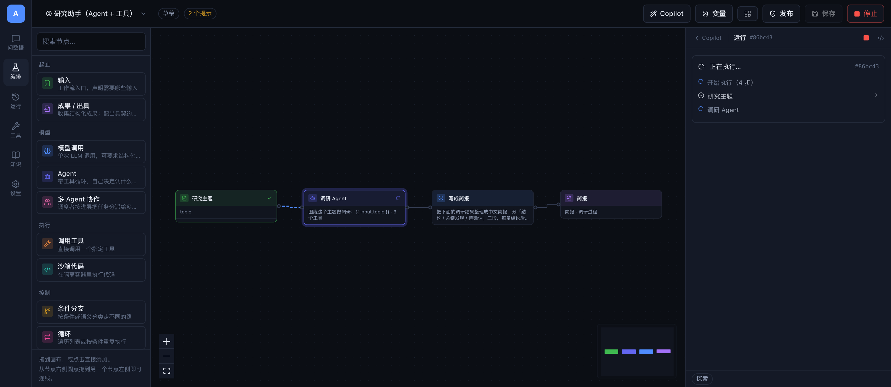
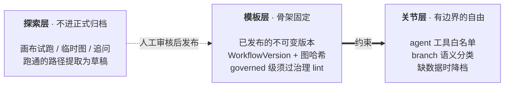
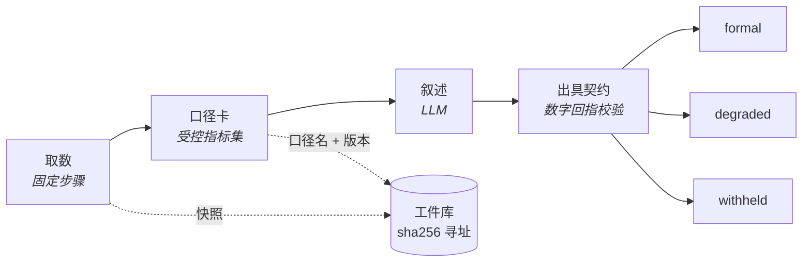
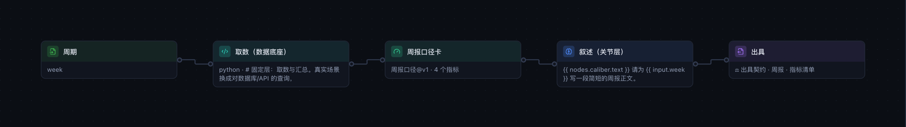
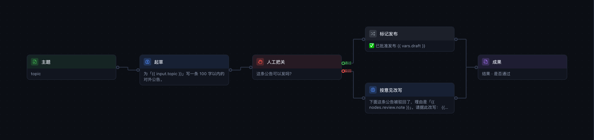
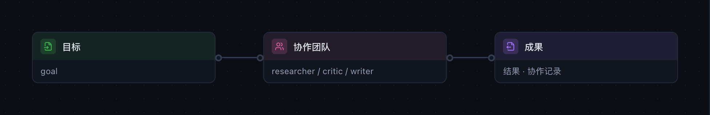
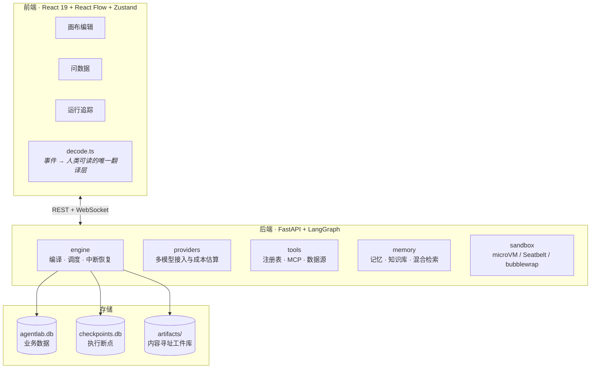

# AgentLab

**可视化 Agent 编排实验台**——在画布上定义工作流，运行时逐节点观察执行过程，
并对产出施加可验证的约束。

面向工业场景的**受限动态编排**：模板定义骨架，agent 只在被授权的关节处自由。
所有算术下沉到受控指标集，叙述层无权创造数字；正式运行钉死在不可变版本上，
每一次执行的完整证据落进内容寻址的工件库。



<sub>研究助手模板执行中：已完成的节点标绿、执行中的节点高亮并显示进度，
右栏是同一份事件流驱动的实时时间线。</sub>

---

## 目录

- [快速开始](#快速开始) · [核心能力](#核心能力) · [受限动态编排](#受限动态编排模板定骨架agent-填关节)
- [工作流形态](#工作流形态) · [节点类型](#节点类型) · [架构](#架构) · [关键设计决策](#关键设计决策)
- [运行环境](#运行环境) · [常见问题](#常见问题) · [开发与验证](#开发与验证)

---

## 快速开始

环境要求：conda（[miniforge](https://conda-forge.org/miniforge/) 即可）、Node 20+、pnpm。
**无需 Docker**——代码沙箱基于操作系统自带的隔离原语，可选升级至 microVM。

```bash
conda env create -f environment.yml   # 首次：创建 agentlab 环境并安装依赖
./scripts/dev.sh                      # 之后：一条命令启动前后端
```

`dev.sh` 自动定位 `agentlab` conda 环境；环境不存在时依 `environment.yml` 创建。
如需使用其他环境名，设置 `AGENTLAB_CONDA_ENV`。

服务启动于 http://localhost:5273 。

**无需配置 API Key 即可完整体验。** 内置 Mock provider 产出流式回复、工具调用与
符合 schema 的结构化数据，编排链路（画布高亮、审批中断、沙箱执行）会完整走一遍。
接入真实模型请在「设置 → 模型接入」配置。启动时若环境变量中存在
`ANTHROPIC_API_KEY` / `ANTHROPIC_AUTH_TOKEN` / `OPENAI_API_KEY`，将自动导入为 provider。

内置 8 个模板，从「最小问答」到「周报（口径卡 + 三档出具）」，既可直接运行，
也是各类节点用法的可执行文档。

---

## 核心能力

| 领域 | 能力 |
|---|---|
| **可视化编排** | 16 种节点拖拽连线；运行时节点实时高亮、边上光点流动画、卡片内直接呈现流式 token；多 agent 节点在卡片里展开协作矩阵（谁在跑、几个人并行、省下多少） |
| **对话式取数** | 「问数据」页：自然语言提问，系统自行接入数据源、生成工作流、执行并给出结论；对话持久化、可分享链接 |
| **多模型接入** | Anthropic / OpenAI / 任意 OpenAI 兼容服务（DeepSeek、Kimi、通义、智谱、硅基流动、Ollama 等）+ Mock |
| **工具链** | 15 个内置工具 + 自定义工具（HTTP 模板 / 沙箱 Python）+ MCP server 接入 |
| **代码沙箱** | 双档隔离：系统沙箱（Seatbelt / bubblewrap，冷启动约 25ms）或 microVM（独立 Linux 内核，内存限额真实生效） |
| **人工介入** | 执行暂停并落盘，人工批准 / 驳回 / 改稿后从断点继续；进程重启不丢状态 |
| **断点续跑** | 失败的运行可从失败节点继续，已完成的节点不重复执行；允许修改节点配置，但拓扑必须一致 |
| **知识库** | 向量 + BM25 混合检索、倒排索引、可选模型重排；PDF / Word / PowerPoint / HTML / Markdown 解析；向量模型可接本地端点 |
| **表格入库** | Excel / CSV 上传后转为可用 SQL 查询的表，自动生成 `db_query__<name>` 工具——数字由 SQL 计算得出，而非模型读取 |
| **长期记忆** | 跨运行的记忆读写与自动去重；Copilot 建图时主动记录应当记住的事实 |
| **Skill 管理** | 将方法论抽象为可复用单元，挂载到节点上注入 system prompt |
| **自然语言编排** | Copilot：一句话生成或改写整张图，自动排版；交付前按运行时同一套规则自查，查出会跑挂的问题先交回去改，改不好就不自动运行 |
| **结构化成果** | JSON Schema 校验，不合格时将错误回传模型自动返工 |
| **产出复核** | 运行结束后规则扫描事件流，发现异常才调用模型复核；复核可重组答案但**不得引入原答案中不存在的数字** |
| **追踪与成本** | 全量事件落库可回放；逐节点耗时、token 用量、按目录价折算的成本 |
| **三档出具** | 口径卡（受控指标集）+ 出具契约：叙述中每个数字回指指标集，formal / degraded / withheld 三档判定 |
| **正式 / 探索分级** | 正式运行仅从已发布的不可变版本发起（按图哈希钉死）；画布试跑自动标记为探索性 |

---

## 受限动态编排：模板定骨架，agent 填关节

工业场景中大多数任务的步骤是已知的（接单报价、周报、体检）。让模型每次现场重新规划，
既是在重复发明已知答案，也使结果不可复现——而不可复现即不可验收。

AgentLab 的引擎是**编译式**的：运行时模型无法修改图结构，其自由被结构性地限制在
agent 节点内部与 branch 决策之中。在此基础上划分三层：



- **模板层**　正式运行只认已发布的不可变版本。发布后修改画布不影响已发布版本。
  governed 级发布须通过治理 lint：禁用 supervisor（全动态归属探索层）、方法卡必须钉版本、
  agent 不得关闭全部审批、output 必须配置出具契约。
- **关节层**　授权范围内的自由。工具白名单衰减报表（`/api/governance/tool-usage`）
  将「已授权但从未使用」的工具显性化，为收缩权限提供依据。
- **探索层**　结果自动标记为探索性，不进正式归档。跑通的路径经「提取模板」沉淀为草稿
  （仅保留实际执行的节点，剪除未走的分支），人工审核后发布。探索问题聚类提示哪些追问
  应当固化为模板中的一节。

### 出具链路

模板⑧是完整示范。设计前提是**派生边界收死**：所有算术发生在口径卡节点内，叙述层只能引用。





校验器从叙述中抽取全部数字逐个回指指标集，支持千分位、百分数与比率互转、千/万/亿后缀、
按书写精度的舍入容差；日期、枚举序号、引用标记不参与回指。三档判定与缺数据声明随成果印出。

中文数字同样回指——否则换一种写法就绕过去了（"增长三成、客户两千五百家"以前能盖 formal 章）。
成、倍、百分之、分之、一半按比例回指，"两千余"按区间 [2000, 3000] 回指；"一个问题""十分重要"
"从三个方面看""三季度""几十家"这类虚指、序数、季度名、结构性列举不算结论数字。

实测记录：Opus 5 撰写的正文数字全部回指成功，但结尾「（约 100 字）」中的 `100` 被判定为
集合外数字并触发降档。处置方式是修改 prompt 而非扩大白名单——这正是校验器应有的行为。

**口径升版是被迫处置事件。** 钉住的方法卡出现新版本时，正式运行将被拒绝启动，
直至模板显式声明升版策略：`recompute`（回算历史）/ `dual`（双印）/ `incomparable`
（标注不可比）。此处无默认值——口径变更最容易静默翻车的形态是「数字看起来都对，
只是与上周不可比」。

每次运行的完整证据存于内容寻址的工件库（`data/artifacts/`，sha256 即地址，取回时复验哈希）；
运行终态的事件清单哈希记录在 Run 上（封存到 `run.finished` 为止），事后修改流水将无法对齐。
运行详情页一键核对，接口是 `GET /api/runs/{id}/verify`；封存之后追加的事件不在核对范围内。

---

## 工作流形态

**人工介入与分支**——执行在 `human` 节点暂停并落盘，人工决策后沿对应出口继续：



**多 Agent 协作**——调度者按进展将任务分派给多个专家，属探索层能力，governed 级发布禁用：



节点间通过模板语法传递数据：

```
{{ input.question }}        入口输入
{{ vars.answer }}           某节点 assign_to 写入的变量
{{ nodes.n1.text }}         指定节点的输出
{{ vars.items | json }}     过滤器：json / compact / upper / length / first …
```

**条件和表达式不是模板。** 分支条件、while 循环条件、整形表达式、口径卡指标、跳过条件
这几处是直接求值的表达式，变量直接写：`vars.gate != 'ok'`、`len(vars.items) > 0`。
多套了 `{{ }}` 意思没有歧义，照 `vars.gate` 理解、只给一条提示；真写错的在校验阶段就拦下，
不会等跑到那一步才炸——`| length` 这类过滤器（改写 `len(x)`）、`{'a', 'b'}` 集合（改用列表）、
不认识的函数、把 `==` 写成 `=`、引号里的 `{{ }}`（它不会被渲染，条件永远不成立）。
校验、Copilot 自查和运行时用的是同一个解析器，不会出现"校验说能跑、跑起来报错"。

**代码节点的结果要 print 出来。** `assign_to` 拿到的是 stdout：脚本最后一行写个裸表达式
不会输出（那是 notebook 的行为），变量会是空的。要交给下游一个对象就
`print(json.dumps(结果))`，stdout 是 JSON 时会自动解析成对象。设了 `assign_to` 却找不到
任何输出的 Python 代码，校验会直接拦下。

连线即并行：单个节点连出多条边构成 fan-out，多条边汇入同一节点时自动等待汇聚——
汇合节点等图里其余待执行的任务都跑完再执行一次，支路一长一短也不会被触发两遍；
分支之后的二选一汇合不会去等没走的那条。代价是它也会等图里与它无关、恰好还在跑的支路。

自动排版按拓扑分层：并行的支路落在同一列，层内按中位数启发式排序以减少交叉，
分支节点的出口按 yes/no 的声明顺序自上而下，循环的回边不参与分层（否则循环体会
被压到循环节点左边）。层与层之间按"穿过这条走廊的连线在竖直方向最多重叠几条"
预留走廊宽度，前端 `canvas/routing.ts` 据此给每条线分配独立的竖直车道——扇出、
汇聚的线因此不会叠在同一段上，跨层的长边则从没有节点的空档绕过去。

---

## 节点类型

| 分类 | 节点 | 说明 |
|---|---|---|
| 起止 | `input` `output` | 声明输入字段 / 收集结构化成果 |
| 模型 | `llm` `agent` `supervisor` | 单次调用 / 带工具循环 / 多 agent 协作 |
| 执行 | `tool` `code` | 直接调用工具 / 沙箱内执行代码 |
| 控制 | `branch` `loop` `subgraph` | 条件或语义分支 / 遍历与条件循环 / 嵌套工作流 |
| 上下文 | `memory` `retrieve` `transform` | 长期记忆读写 / 知识检索 / 数据整形 |
| 把关 | `human` `validate` `metrics` | 人工介入 / Schema 校验与自动返工 / 口径卡 |

---

## 架构



```
backend/                  FastAPI + LangGraph
  app/engine/             画布 JSON → StateGraph 的编译与执行
    schema.py             图定义与静态校验
    compiler.py           编译：节点包装、事件、重试、条件路由
    runner.py             执行调度、事件总线、中断与恢复
    issuance.py           出具契约：数字回指与三档判定
    review.py             产出复核：事件流规则扫描 + 模型复核
    expressions.py        模板插值 + AST 白名单表达式求值
    nodes/                各类节点的执行器
  app/data/               数据源接入：连接、SQL 守卫、结构探查、表格导入
  app/providers/          多模型接入与成本估算
  app/sandbox/            microVM / Seatbelt / bubblewrap / 裸子进程四后端
  app/tools/              工具注册表、内置工具、MCP、自定义工具
  app/memory/             记忆、知识库、倒排索引、混合检索、文档解析
  app/api/                REST + WebSocket
frontend/                 React 19 + React Flow + Zustand
  src/canvas/nodeDefs.ts  节点元数据——属性面板、节点库、连接桩均由其驱动
  src/canvas/routing.ts   连线走线：端口错开、走廊车道、长边绕行
  src/run/decode.ts       事件流 → 人类可读步骤的唯一翻译层
  src/store/studio.ts     画布状态 + 事件流到高亮的映射
environment.yml           conda 环境定义
scripts/dev.sh            一键启动
scripts/check-*.mjs       前端验证脚本
```

---

## 关键设计决策

### 选用 LangGraph

可视化编排的难点不在绘制节点与连线，而在暂停、恢复与回放。LangGraph 的 checkpointer 与
`interrupt()` 将这几件事做在了底层：人工介入是一次中断加一次 `Command(resume=...)`，
进程重启后仍可从断点继续；`aget_state_history()` 直接给出每一步的状态快照。

由此派生的第二项收益：**agent 内部的工具审批不重复计费**。`interrupt()` 会使整个节点重放，
朴素实现将重复执行此前的模型调用。agent 节点内的模型调用与工具执行均包裹在 LangGraph 的
`@task` 中，结果进入 checkpoint，重放时直接读取缓存。

### 事件流是唯一的可视化数据源

节点通过 `get_stream_writer()` 发出事件，runner 转换为 `RunEvent` 落库并广播。
画布高亮、token 流、工具卡片、时间线全部由同一份事件驱动——刷新页面或中途接入
均可获得完整过程（WebSocket 先补历史再接实时）。

前端侧对应地只有一个翻译层 `run/decode.ts`：画布右栏、问数据页、运行详情页共用它。
分设多套的后果是同一次运行在三个页面讲出三个版本，而使用者无从判断哪个为真。

### 画布上的动效是"正在发生的事"，不是装饰

画布上每一个会动的东西都对应一件真实事件：边框上转一圈光弧 = 这个节点正在跑，
扫描线扫过 = 正在产出，绿色扫一遍 = 刚跑完，抖动 = 刚失败，琥珀呼吸 = 在等人，
边上的光点 = 数据正从这边流向那边。跑一张十几个节点的图，一眼要能看出"谁在动"——
纯装饰的动效做不到这件事，只会让画布变吵。

多 agent 节点会**在卡片里展开协作矩阵**：花名册固定不重排，被派出去的人亮起来并
显示当前任务，条形长度按"这一轮里最慢的那个人"归一化——三个人并排三条长短不一的
条，墙钟为什么等于最长那条而不是三条之和，不用解释就看懂了；页脚给出并行一共省下
多少。分支节点跑完会点亮命中的那个出口、压暗其余，实际走过的边留在画布上，就是
这一次的执行路径。

矩阵和右栏泳道读的是**同一份** `reduceTeam`（`run/decode.ts`），两处不会给出不同的
并行度。系统里关掉动效时（`prefers-reduced-motion`）光效整体不绘制而不是停住——
停在最后一帧的光弧和堆在起点的光点看着像渲染坏了；静态下"谁在跑"由实心圆点和
"进行中"三个字承担。

### 沙箱：双档隔离，以及必须声明的缺口

轻量档使用操作系统自带的访问控制：macOS 的 Seatbelt（`sandbox-exec`）、Linux 的 bubblewrap，
冷启动约 25ms，无需额外安装。重量档为 microVM（libkrun + Hypervisor.framework），
启动带独立内核的虚拟机。

两档共同保证三项约束：**默认断网**、**家目录不可读**、**仅工作区可写**。Seatbelt 侧策略
由内核强制且对子进程继承——沙箱内 `subprocess` 启动的 `cat` 读取家目录同样返回
`Operation not permitted`；解释器刻意使用 `sys.base_prefix` 下的干净 Python 而非项目环境，
因此沙箱代码无法 import FastAPI、SQLAlchemy 及任何凭据处理相关模块。

**Seatbelt 的局限**：它提供访问控制而非虚拟化。进程表共享（可见宿主机进程列表）；
代码以当前用户身份运行（不似容器会降权至 nobody）；**macOS 不强制 `RLIMIT_AS`，
内存用量无法限制**（实测设定 256MB 仍可分配 900MB）。CPU 时间、单文件大小、
墙钟超时三项有效。

**microVM 补齐的正是内存这一项。** 本机实测：宿主为 Darwin 27.0.0，VM 内为 Linux 6.12.99
（libkrunfw 编译），PID 1 为 `init.krun`，`/Users` 在 VM 内不存在，`free` 仅显示 512MB。
申请 900MB 将被内核 OOM killer 终止而 VM 存活——`RLIMIT_AS` 在 macOS 上形同虚设的问题
在此不是被修复，而是结构上不存在。两台 VM 之间亦互不可见。

代价：运行时约 50MB，OCI 镜像**首次拉取实测 54.5 秒**；缓存后热启动 0.19 秒、
VM 内执行 7–30ms。成本集中在首次而非每次——因此 auto 模式在镜像未缓存时优先使用 Seatbelt，
避免一分钟的等待（显式指定 strict 不受此限）。

> **网络隔离不完整，此项须置于前列。**
> `network=false` 时 HTTP/HTTPS 与域名解析均被切断，但 **UDP/53 无法拦截**——实测手写
> DNS 包仍可获得真实响应。`default_egress=DENY`、`Rule.deny_dns()`、显式 deny UDP、
> `max_connections=0` 均已尝试，UDP 通道始终无法封堵（`deny_dns` 生成的规则仅作用于宿主，
> DNS 出口在 microsandbox 的网络栈中硬编码放行）。
> 即 **DNS 隧道外泄通道始终开放**。该隔离足以防范「代码意外联网安装依赖」，
> 不足以防范「恶意代码窃取数据」。设置页据此将网络一项标注为「部分生效」的黄色而非绿色——
> 拦截了一半却显示为全绿，比显示为全红更危险。真正的外泄防护须在网络层实施。

### 检索为何是混合的

默认 embedding 为本地特征哈希：不联网、不下载模型、零配置可用，但语义泛化能力弱。
BM25 补齐精确关键词匹配。两者各自归一化后加权，权重在界面上可调，命中结果分别显示
语义分与关键词分。

实测（24 文档 / 16 问题评测集，hit@1）：

| 配置 | hit@1 | 字面类 | 语义类 |
|---|---|---|---|
| 纯关键词（alpha=0） | 88% | 100% | 75% |
| 纯向量（本地哈希，alpha=1） | 81% | 88% | 75% |
| 混合 + Qwen3-Embedding-4B | 94% | 100% | 88% |
| 上述配置叠加模型重排 | 100% | — | — |

值得注意的一项：纯向量（81%）低于纯关键词（88%），混合才达到 94%。专有名词依靠 BM25、
同义改写依靠向量，两者各担一半——混合检索在该语料上是必要的，而非装饰。
样本量为 16 题，单题即 6 个百分点，结论的方向可信而精度不可过度解读。

向量模型可接任意 OpenAI 兼容端点（LM Studio、Ollama、vLLM、TEI）。维度通过实际探测获得
而非按模型名推断——本地部署的模型维度各异（bge-m3 为 1024、Qwen3-Embedding-4B 为 2560），
推断错误的后果不是偏差，而是全部存量向量被判定为与当前 embedder 不匹配，检索整体退回关键词。

### 表格数据必须成为表

Excel / CSV 若传入知识库，只能被切块检索，数字即成为模型从片段中「读取」的结果。
而本项目的基础约定是「所有算术下沉到 SQL 或口径卡」——产出复核层能拦截凭空出现的数字，
无法拦截「从一堆片段中读错了一格」。

因此表格上传后落为 SQLite 文件并注册为 `kind=sqlite` 的数据源，自动生成
`db_query__<name>` 工具。列类型逐列推断（INTEGER / REAL / TEXT），空单元格存为 NULL——
整数列若落为 TEXT，`ORDER BY` 将退化为字典序（`'10' < '9'`），且不产生任何报错。

### 安全边界

- 分支条件使用 AST 白名单求值器而非 `eval`
- HTTP 工具解析域名后逐 IP 检查，拦截内网、回环与云元数据地址，且不跟随重定向（逐跳重新校验）
- 文件工具路径 `resolve()` 后必须仍位于工作区内
- SQL 守卫采用白名单动词判定 + 正文扫描 + 多语句拦截 + 结果集上限；`DROP` / `TRUNCATE` / `GRANT` 等
  在可写数据源上亦一律拒绝。以查询开头却会写的语句（`WITH … DELETE`、`SELECT … INTO`、
  `EXPLAIN ANALYZE`、`PRAGMA … =`、`set_config()` 等）按写操作处理
- 只读数据源在**连接层**也只读，不只靠守卫猜：SQLite 以 `mode=ro` 打开，PostgreSQL / MySQL
  会话事务只读。**Oracle 没有会话级只读开关**，只剩守卫一道——只读数据源请配只读账号
- 人工审批只认明确的批准（`true` / 同意 / approve），看不懂的回复一律按拒绝处理。
  危不危险逐次判定：同一个 `db_query__<源>`，查询直接执行，可写源上的写操作要先确认，
  确认后才提交。协作团队的成员停不下来等人，需要确认的调用不执行，会告诉成员换一种做法
- API Key 经 Fernet 加密落库，仅向前端返回掩码

---

## 运行环境

### 沙箱后端选择

设置页「运行环境」列出全部候选及其可用性，并标注当前选中项。安装 microVM 依赖且镜像已缓存时
auto 选择 `microvm`；否则 macOS 使用 `seatbelt`、Linux 上安装 `bwrap`
（`apt install bubblewrap`）后使用 `bubblewrap`；均不可用时降级至 `local`——**该路径不含任何
访问控制**，界面明确标红。可通过 `AGENTLAB_SANDBOX_BACKEND` 强制指定，
亦可在代码节点上单独选择隔离档位（strict = microVM，fast = 系统沙箱）。

### 启用 microVM

三项准备，**均为一次性**——日常启动仍只需 `./scripts/dev.sh`：

1. Python 包：使用 `environment.yml` 创建环境时已包含（含 `[microvm]` extra）
2. 运行时（约 50MB，落于 `~/.microsandbox`）：每台机器一次
3. OCI 镜像（实测约 55 秒）：首次执行代码时自动拉取，每个镜像一次

仅第 2 项需手动执行：

```bash
conda run -n agentlab python -c "import asyncio,microsandbox as m; asyncio.run(m.install())"
```

三项均落于磁盘，重启机器或重开终端无需重来。设置页「运行环境」中 `microvm` 条目的
`warm` 为 true 即表示三项齐备，auto 将自动升级至 `microvm`。镜像可通过
`AGENTLAB_MICROVM_IMAGE` 更换，闲置 VM 回收时间由 `AGENTLAB_MICROVM_IDLE_SECONDS` 控制。

### 可选依赖

```bash
pip install -e 'backend[docs]'     # PDF / Word / PowerPoint / Excel 解析
pip install -e 'backend[db]'       # MySQL / PostgreSQL / Oracle 驱动
pip install -e 'backend[microvm]'  # microVM 沙箱
pip install -e 'backend[dev]'      # pytest
```

### 数据位置

全部位于 `data/`：`agentlab.db` 业务数据、`checkpoints.db` 执行断点、
`artifacts/` 工件库、`workspace/` 沙箱文件、`uploads/` 上传文件、`.secret_key` 加密密钥。
删除 `data/` 即恢复出厂设置。

---

## 常见问题

**模型返回空内容。** Claude 4.6 之后的模型默认启用 thinking，`max_tokens` 过小会出现
「思考耗尽额度，正文为空」。将节点的 max_tokens 调大，或将思考模式设为关闭。
时间线中会给出相应提示。

**中转网关返回 401。** 部分网关仅接受 `Authorization: Bearer`，且额外携带 `x-api-key`
即会拒绝。在 provider 设置中勾选「用 Authorization: Bearer 认证」。

**数据源结构探查失败。** 探查失败与「尚未探查」是两种状态：前者点击按钮无法解决，
需先处理超时或更换 schema。数据源卡片会显示失败原因与该服务器上的可选库列表。
agent 侧同样会收到实情，并被告知可直接查询 `information_schema` 自行确认表结构。

**端口冲突。** 前端默认 5273、后端 8000，通过 `AGENTLAB_WEB_PORT` / `AGENTLAB_PORT` 修改。

**改了后端代码，正在跑的运行显示中断。** `dev.sh` 开着热重载，改一个后端文件就是一次
服务重启。运行会被挂起（不是取消），断点完好：在运行详情页点「接着跑」，跑完的节点不会重跑，
后面的人工审批照常停下来等人。

**运行被中止，提示超过时限。** 单次执行（两次人工介入之间的那一段）默认最多 600 秒，
单次模型调用默认 300 秒没有输出即超时。多半是模型或工具没有响应；确实需要更久，调大
`AGENTLAB_MAX_RUN_SECONDS` / `AGENTLAB_MODEL_TIMEOUT_SECONDS`。设置页「运行环境」里能看到当前值。

---

## 开发与验证

```bash
# 后端：292 个测试
cd backend && pytest tests

# 前端类型检查
cd frontend && npx tsc -b

# 前端验证（需先启动 ./scripts/dev.sh）
node scripts/check-decode.mjs        # 事件 → 步骤的翻译是否正确
node scripts/check-stream.mjs        # 助手流组件渲染是否正确
node scripts/check-ui.mjs            # 真浏览器端到端：URL 寻址、会话、运行详情
node scripts/check-canvas-layout.mjs # 排版与连线几何：线有没有叠、有没有穿过卡片
node scripts/check-canvas-fx.mjs     # 运行态动效：协作矩阵、并行度、命中的出口、关掉动效
node scripts/check-guards.mjs        # 护栏：输入法回车、未知节点类型、页面级错误边界（不写库）
node scripts/e2e-check.mjs           # 冒烟：打开画布 → 选模板 → 运行 → 观察高亮
```

三层前端验证的分工：`check-decode` 守「翻译对不对」，`check-stream` 守「画出来对不对」，
`check-ui` 守「整条路走得通不通」。三者可各自通过而合起来是坏的——例如 Step 字段全部正确，
组件却将其渲染为一屏转义 JSON。

`check-canvas-fx` 守的是「事件对了但界面没跟上」：把脚本化的事件灌进 store（走的是
页面上那一份 applyEvent / NodeCard / FlowEdge，只有事件来源是脚本），断言协作矩阵
真的长出来了、并行度算对了、条形长度和耗时成正比、分支命中的出口被点亮、系统关了
动效时光效确实不绘制。真跑一张多 agent 的图要连模型、要等十几秒，而且撞不上
"三个人同时还在跑"那一瞬间——那样的检查会变成偶发失败。

`check-canvas-layout` 单独守「图好不好看」里唯一能算的那部分：它把夹具图交给后端
`/api/copilot/layout` 排版，再直接 `import('/src/canvas/routing.ts')` 用页面上正在跑的那份
走线代码算路径，然后按几何断言——没有两条线压在同一段上、没有线从别人的卡片中间穿过去、
每条线的两端都接在节点边缘。连线叠成一团时 `check-ui` 和 `e2e-check` 一个字都不会说。

## License

This project is **source-available** and is licensed under the [PolyForm Noncommercial License 1.0.0](https://polyformproject.org/licenses/noncommercial/1.0.0).

### Noncommercial Use

You may use, study, modify, experiment with, and develop upon this software for purposes permitted under the PolyForm Noncommercial License 1.0.0.

Typical permitted noncommercial uses include:

* personal research;
* learning and education;
* experimentation;
* evaluation and testing;
* hobby projects;
* noncommercial software development.

See the [`LICENSE`](./LICENSE) file for the applicable license terms.

### Commercial Use

**Commercial use is not permitted without prior written authorization from Yilun JIANG.**

If you intend to use this software in a commercial product, commercial service, SaaS offering, customer project, commercial deployment, or other commercial context, you must obtain a separate commercial license before doing so.

For commercial licensing, see [`COMMERCIAL-LICENSE.md`](./COMMERCIAL-LICENSE.md) or contact:

**Yilun JIANG**
**[me@thearchyhelios.com](mailto:me@thearchyhelios.com)**

### Copyright

Copyright (c) 2026 Yilun JIANG.

All rights reserved except as expressly granted under the applicable license.

